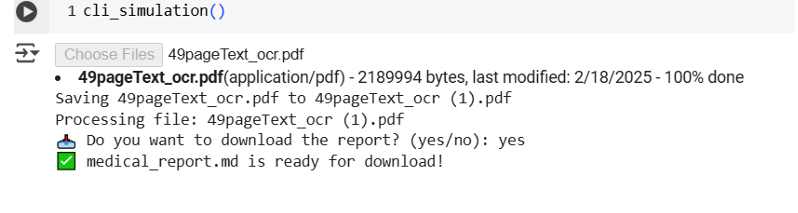

# **Implement LLM Solutions for Summarizing Medical/Health Care Report**

This project focuses on developing an end-to-end system that extracts text from medical reports (PDFs), preprocesses the information, summarizes it using a Large Language Model (LLM), ensures data privacy, and provides a user-friendly interface.


## **Step 1: PDF Text Extraction**
The first step is to extract text from medical reports, which are usually provided in PDF format.

Depending on the type of PDF:

#### 1. For Searchable PDFs

```markdown
pdfplumber - Extract text from searchable pdf
```
```python
pip install pdfplumber
```


#### 2. Scanned Pdf
```markdown
For scanned PDFs or image-based PDFs, OCR (Optical Character Recognition) is required to recognize text from images

Tesseract is a widely used open-source OCR tool, and the pytesseract library provides an interface for Python

pdf2image library converts PDF pages into images
```

```python
pip install pytesseract pdf2image
```


## **Step2: Preprocessing Data**
After text extraction, the next step is to clean and organize the data

#### 1. Remove unnecessary metadata and formatting issues
Using the re library (regular expressions), we clean:

- Headers and Footers (repeated titles, page numbers).

- Links (URLs, email addresses).

- Digital Signatures and other non-informative text.

This improves the quality of the data before summarization.

#### 2. Structure extracted text into sections
Medical reports usually have clear sections like:

- Patient Information
- Diagnosis
- Chief Complaint
- Treatment
- Recommendations
- History of Present Illness
- Physical Examination
- Medications

We organize the extracted text into structured formats (like dictionaries or JSON) to make the summarization more accurate.


## **Step 3: LLM-Based Summarization**
Once the text is clean and structured, we use a **Large Language Model (LLM)** to generate a clear and concise summary.

We leverage **Google Gemini** to understand and summarize the key information automatically.

```python
pip install google-generativeai
```


## **Step 4: Ensure Compliance with Data Privacy Laws**
Since medical data is sensitive, it is important to anonymize personal information.

- We use spaCy's Named Entity Recognition (NER) to detect and replace patient names.
- We use regex to remove or mask additional identifiable information (such as age, dates, and digital signatures).

This helps ensure compliance with data privacy regulations like HIPAA

## **Step 5 : User Interface**
To make the tool accessible:

- A simple Command Line Interface (CLI) is developed.
- Users can upload a PDF, and the system will automatically extract, summarize, anonymize, and output the result.
- Users can download the summary as a Markdown (.md) file.

This allows non-technical users to easily interact with the system




## ✅ Summary

- This project provides a complete solution for summarizing medical reports using LLMs, focusing on:
- Accurate text extraction
- Proper data cleaning and structuring
- Automated summarization
- Data privacy compliance
- Easy-to-use CLI for interaction
